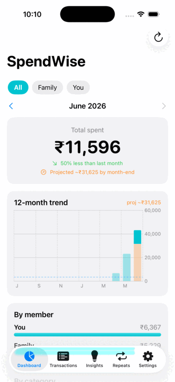

# SpendWise — Spending Analysis for iOS

SwiftUI app that pulls bank transaction alerts from Gmail, shows a spending dashboard, and suggests ways to cut spending and invest the difference. All data stays on-device.

**Why Gmail and not SMS?** iOS does not let third-party apps read SMS — that's an Apple platform restriction (Android-only feature). Gmail alerts from your banks carry the same transaction data.

## Features

- **Dashboard** — monthly total, category donut chart, daily spend trend, month-over-month comparison
- **Transactions** — searchable list, manual add, swipe to delete, long-press to recategorize
- **Insights** — category spend spikes, food-delivery overuse, subscription detection, small-purchase leaks
- **Investment suggestions** (India) — SIP/index funds, FD/liquid funds, PPF, ELSS — educational only
- **Gmail sync** — parses debit alerts from HDFC, ICICI, SBI, Axis, Kotak, IDFC First (read-only scope)
- **Apple Intelligence** (iOS 26+, on-device) — three Foundation Models features that all run on-device:
  - *Categorization* — the on-device LLM is the primary categorizer for imported transactions, falling back to the embedding classifier below when Apple Intelligence is off or unavailable.
  - *Insights summary* — the Insights tab opens with a natural-language overview of your month plus tailored money-saving tips.
  - *Ask your data* — tap "Ask about your spending" to chat with your own finances ("How much on food this month?", "Which subscriptions am I paying for?"); answers are grounded in a local digest and never leave the device.
- **Smart categorization** — an on-device, self-improving classifier (exact-merchant memory + `NLContextualEmbedding` kNN, warm-started from keyword rules) learns from your corrections; used as the fallback when Apple Intelligence isn't available. No data leaves the device
- **Custom rules** — in-app editor (Settings → Rules) to add bank senders and keyword→category mappings that take precedence over the built-in ones
- **Family spending** — connect multiple Gmail accounts (one per family member); every transaction is tagged with its owner. Filter the dashboard by member, see a "By member" breakdown, rename accounts to "Mom"/"Dad" in Settings
- **App lock** — optional Face ID / Touch ID lock (with passcode fallback) that re-locks on backgrounding
- Ships with sample data so the app works immediately, before Gmail is connected

## Screenshots

Running on the bundled sample data — Dashboard, Transactions, Insights, Repeats, Settings:

<p align="center">
  
</p>

## Requirements

- Mac with **Xcode 16+**
- iPhone running **iOS 17+** (or simulator)
- Free Google Cloud account (for Gmail sync)

## Run it

1. Open `SpendWise.xcodeproj` in Xcode.
2. Select the SpendWise target → Signing & Capabilities → choose your Team (free Apple ID works).
3. Pick a simulator or your iPhone → ⌘R.

The app runs with sample data out of the box. Gmail sync needs the one-time setup below.

## Gmail setup (one-time, ~10 minutes)

1. Go to [Google Cloud Console](https://console.cloud.google.com/) → create a project (e.g. "SpendWise").
2. **APIs & Services → Library** → enable **Gmail API**.
3. **APIs & Services → OAuth consent screen** → External → fill app name + your email → add scope `gmail.readonly` → add yourself as a **Test user**.
4. **APIs & Services → Credentials → Create Credentials → OAuth client ID** → Application type: **iOS** → Bundle ID: `com.eduquizacademy.spendwise` (must match the Bundle Identifier in Xcode).
5. Copy `Secrets.swift.example` (repo root) to `SpendWise/Secrets.swift` and paste in your client ID:
   ```swift
   enum AppSecrets {
       static let googleClientID = "1234567890-abc.apps.googleusercontent.com"
   }
   ```
   `SpendWise/Secrets.swift` is git-ignored, so your credential is never committed.
6. Run the app → Settings tab → **Connect Gmail** → sign in. It fetches the last 90 days of alerts.
7. **Family members**: tap **Add family member's Gmail** in Settings and have them sign in on your phone. Each account must also be added as a Test user in step 3.

Notes:
- While the consent screen is in "Testing" mode, only the test users you added can sign in — fine for personal use, no Google review needed.
- The app requests only `gmail.readonly` and filters to bank-alert senders. Tokens live in the iOS Keychain; transactions in a local JSON file.

## Customizing

- **No code needed**: add bank senders and keyword→category rules in-app via **Settings → Rules**. Custom rules persist on-device and override the built-ins.
- **Add your bank in code**: extend `bankSenders` in `TransactionParser.swift` and, if its email wording differs, the regexes there.
- **Built-in category rules**: edit `categoryRules` in `TransactionParser.swift` — these also seed the on-device classifier in `CategoryClassifier.swift`.
- **Insight thresholds**: tune the rules in `InsightsEngine.swift`.

## Project layout

```
SpendWise/
├── SpendWiseApp.swift              App entry, tab bar
├── Models/Transaction.swift        Transaction + category model
├── Stores/
│   ├── TransactionStore.swift      State, persistence, analytics, sample data
│   └── RulesStore.swift            User-editable sender + category rules
├── Services/
│   ├── GmailService.swift          OAuth (PKCE) + Gmail API fetch
│   ├── TransactionParser.swift     Regex parsing of Indian bank alert emails
│   ├── CategoryClassifier.swift    On-device embedding classifier (fallback)
│   ├── AICategoryClassifier.swift  Apple Intelligence categorizer (primary, iOS 26+)
│   ├── AIInsightsService.swift     Apple Intelligence insights summary (iOS 26+)
│   ├── AIQueryService.swift        Apple Intelligence spending Q&A (iOS 26+)
│   ├── InsightsEngine.swift        Savings + investment suggestion rules
│   └── AppLock.swift               Optional Face ID / Touch ID app lock
└── Views/                          Dashboard, Transactions, Insights, Rules,
                                    Settings, AskAI (spending Q&A sheet)
```

## Disclaimer

Investment suggestions are rule-based educational pointers, not financial advice. Consult a SEBI-registered investment advisor for personalised guidance.

## License

Licensed under the [Apache License, Version 2.0](LICENSE). Copyright 2026 Sajal Maity.
